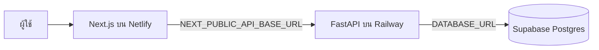

# Next-path Deployment

เอกสารนี้สรุปโครงสร้าง production และขั้นตอนตรวจสอบระบบที่ deploy อยู่

## Production URLs

| ส่วนระบบ | ผู้ให้บริการ | URL |
| --- | --- | --- |
| Frontend | Netlify | [nextpathla-public-v2.netlify.app](https://nextpathla-public-v2.netlify.app/) |
| Frontend branch สำรอง | Netlify | [main--nextpathla-public-v2.netlify.app](https://main--nextpathla-public-v2.netlify.app/) |
| Backend API | Railway | [next-path-production.up.railway.app](https://next-path-production.up.railway.app/) |
| Backend health check | Railway | [GET /health](https://next-path-production.up.railway.app/health) |
| Database | Supabase | `nextpath-db` (`rxuosvuatbzjadmynpgo`) |

ชื่อเดิม `nextpathla.netlify.app` และ `nextpathla-public.netlify.app` ไม่ใช่ URL production ปัจจุบันแล้ว

## Architecture



## Repository

- GitHub: [pheuangvichithkeokisith-del/next-path](https://github.com/pheuangvichithkeokisith-del/next-path)
- Branch ที่ deploy: `main`
- ล่าสุดที่ใช้แก้ backend: `baef3827c26c848e8786b493fc1c976998c42e3c`

## Environment configuration

### Netlify

ตั้งค่า environment variable ต่อไปนี้ใน production:

```text
NEXT_PUBLIC_API_BASE_URL=https://next-path-production.up.railway.app
```

### Railway

ตัวแปรสำคัญของ service `next-path`:

- `DATABASE_URL` — URL เชื่อมต่อ Supabase Postgres
- `CORS_ORIGINS` — อนุญาต production และ branch URLs ของ Netlify
- `SECRET_KEY`
- `ENVIRONMENT`
- `DEBUG`
- `PORT`

ไม่ควรบันทึกค่าจริงของ secret หรือ database URL ลง Git

## Deploy flow

1. Push การเปลี่ยนแปลงไปที่ branch `main` บน GitHub
2. Netlify สร้าง deploy ใหม่จาก repository และ build frontend ด้วย Next.js
3. Railway deploy backend จากโฟลเดอร์ `backend/`
   - container จะตรวจฐานข้อมูลเดิม, ระบุ baseline ที่มีอยู่ถ้าสร้างด้วย `create_all`, แล้วรัน `alembic upgrade head` ก่อนเปิด API
4. ตรวจสอบสถานะ deploy ให้เป็น `Ready` หรือ `Success`
5. เปิดหน้า production และทดสอบการสร้าง session ใหม่

## Verification checklist

- เปิด [production frontend](https://nextpathla-public-v2.netlify.app/)
- เปิด [backend health check](https://next-path-production.up.railway.app/health) และตรวจว่าตอบสถานะ `ok`
- เริ่มแบบสำรวจจนถึงหน้า assessment
- ตรวจว่าไม่มีข้อความ error ตอนสร้าง session หรือบันทึกคำตอบ
- ตรวจ CORS หากเปลี่ยน URL frontend หรือเพิ่ม deploy preview

## Known deployment details

- แบบสอบถามรุ่น `v4.0.0` ถูกเก็บไว้ใน backend image ที่ `backend/app/data/questions_v4.json`
- Backend ต้อง deploy จาก commit ที่มีไฟล์นี้ ไม่เช่นนั้นการสร้าง session รุ่น `v4.0.0` จะตอบ `500`
- หากเปลี่ยนชื่อ Netlify site ต้องเพิ่ม URL ใหม่ใน `CORS_ORIGINS` ของ Railway แล้วรอให้ service redeploy; URL ปัจจุบันคือ `https://nextpathla-public-v2.netlify.app`
- Netlify production และ deploy preview เปิด public แล้ว ไม่ต้องใช้ Netlify SSO หรือ password
- การเปลี่ยน schema ใช้ Alembic migrations; อย่าลบหรือ reset ตาราง production เพื่อแก้ schema

## Rollback

หาก deploy ใหม่มีปัญหา ให้ rollback ไปยัง deployment ล่าสุดที่สถานะ `Success` ใน Netlify หรือ Railway แล้วตรวจ health check และการสร้าง session อีกครั้งก่อนเปิดให้ผู้ใช้ใช้งานต่อ
