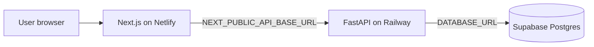

# Next-path Deployment

This document describes the production topology and the checks used after a deployment.

## Production URLs

| Component | Provider | URL |
|---|---|---|
| Frontend | Netlify | [nextpathla-public-v2.netlify.app](https://nextpathla-public-v2.netlify.app/) |
| Frontend branch preview | Netlify | [main--nextpathla-public-v2.netlify.app](https://main--nextpathla-public-v2.netlify.app/) |
| Backend API | Railway | [next-path-production.up.railway.app](https://next-path-production.up.railway.app/) |
| Backend health check | Railway | [GET /health](https://next-path-production.up.railway.app/health) |
| Database | Supabase | `nextpath-db` (`rxuosvuatbzjadmynpgo`) |

The older `nextpathla.netlify.app` and `nextpathla-public.netlify.app` addresses are historical and are not the current production URL.

## Architecture



## Repository

- GitHub: [pheuangvichithkeokisith-del/next-path](https://github.com/pheuangvichithkeokisith-del/next-path)
- Deployment branch: `main`
- Latest documentation commit: `98c58d8`
- Latest backend runtime fix: `baef3827c26c848e8786b493fc1c976998c42e3c`

## Environment configuration

### Netlify

Set this production variable:

```text
NEXT_PUBLIC_API_BASE_URL=https://next-path-production.up.railway.app
```

### Railway

Important service variables:

- `DATABASE_URL` — Supabase connection string
- `CORS_ORIGINS` — comma-separated production and preview origins
- `SECRET_KEY` — application signing secret
- `ENVIRONMENT` — runtime environment name
- `DEBUG` — debug flag
- `PORT` — service port

Never commit real secrets or database credentials to Git.

## Deployment flow

1. Push a change to the `main` branch on GitHub.
2. Netlify builds the Next.js frontend from the repository.
3. Railway builds the Backend service from `backend/`.
4. The Backend container safely prepares the existing database and runs `alembic upgrade head` before opening the API.
5. Confirm the deployment is successful and the service is online.
6. Run the production smoke checks below.

## Verification checklist

- Open the [production frontend](https://nextpathla-public-v2.netlify.app/).
- Open the [Backend health check](https://next-path-production.up.railway.app/health) and confirm HTTP 200 with `status: ok`.
- Open the introduction page and start a new session.
- Confirm that session creation and answer writes produce no browser errors.
- Complete a test session and confirm that the report page opens.
- Verify JSON and Markdown report export when required.
- If the frontend hostname changed, verify the CORS response header for that origin.

## Known deployment details

- The v4 questionnaire is bundled at `backend/app/data/questions_v4.json`.
- The Backend must be deployed from a commit containing the v4 assets; otherwise v4 session creation can fail.
- If the Netlify site name changes, add the new HTTPS origin to Railway `CORS_ORIGINS` and redeploy Railway. The current origin is `https://nextpathla-public-v2.netlify.app`.
- The public production site does not require Netlify SSO or password protection.
- Database changes must use Alembic migrations. Do not reset or manually delete production tables to change the schema.
- Production application startup does not call SQLAlchemy `create_all`; Alembic is the only production schema owner.

## Rollback

If a deployment fails:

1. Roll back to the most recent successful Netlify or Railway deployment.
2. Confirm the Backend health check.
3. Confirm session creation and report retrieval.
4. Review logs before attempting the next change.
