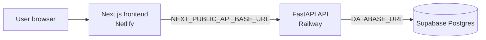

# Next-path Project Documentation

This document is the English overview for the Next-path project. It describes the current production system, the contracts between its parts, and the rules for future upgrades.

## 1. Product purpose

Next-path is a Lao-first self-exploration and career-direction website for young people. It helps users reflect on interests, skills, values, work preferences, constraints, and possible directions.

The product provides patterns and options for exploration. It does not diagnose a user, promise a specific career outcome, or decide the user's future.

The current questionnaire does not require a name, email address, or phone number. Sessions are anonymous and are identified internally by UUIDs and, after completion, by a readable response code.

## 2. Current production architecture



### Production services

| Component | Provider | Current address |
|---|---|---|
| Frontend | Netlify | <https://nextpathla-public-v2.netlify.app/> |
| Backend API | Railway | <https://next-path-production.up.railway.app/> |
| Backend health check | Railway | <https://next-path-production.up.railway.app/health> |
| Database | Supabase | `nextpath-db` (`rxuosvuatbzjadmynpgo`) |
| Source repository | GitHub | <https://github.com/pheuangvichithkeokisith-del/next-path> |

The older Netlify addresses are retained only as historical references. New links should use `nextpathla-public-v2.netlify.app`.

## 3. Repository map

```text
app/                 Next.js pages and routes
api/                 Frontend API clients
components/          Shared frontend components
content/             Shared Lao UI copy
hooks/               Session and polling hooks
types/               Frontend contract types
utils/               Browser draft persistence helpers

backend/app/         FastAPI application
backend/alembic/     Database migrations
backend/tests/       Backend and integration tests
backend/app/data/    Runtime questionnaire data

v4.0/                Versioned v4 form, scoring, and report material
docs/                Project, data science, frontend, and deployment docs
scripts/              Snapshot and audit tooling
snapshots/           Regression snapshots
```

## 4. Runtime questionnaire versions

### Active form: v4.0.0

The production web flow uses the v4 form:

- Demographics: `D1` age, `D2` gender, `D3` province
- Main questionnaire: `Q1` through `Q28`
- Multi-select questions keep their selected option codes
- Age is stored as a numeric value in the database for analysis
- The report response does not expose numeric age in its context payload

Runtime definitions are bundled in `backend/app/data/questions_v4.json` and the versioned material is kept under `v4.0/`.

### Legacy compatibility: v0.9.1

The legacy form and Signal Engine remain available for compatibility and regression coverage. v4 scoring and legacy scoring must remain separate. Do not mix option codes, formulas, or report templates between the two versions.

## 5. End-to-end data flow

```text
1. Frontend requests the active questionnaire form.
2. Frontend creates an anonymous session.
3. Frontend sends demographic values and answers to the API.
4. Backend upserts one answer row per session and question.
5. Frontend completes the session.
6. Backend records completion time and derives queryable demographic fields.
7. Backend runs the version-specific scoring/report service.
8. Backend stores the report snapshot and ranked paths.
9. Frontend requests the report and optionally exports it as JSON or Markdown.
```

The browser never connects directly to Supabase. Database access is owned by the Backend service.

## 6. Backend API contract

### Health and form

| Method | Endpoint | Purpose |
|---|---|---|
| `GET` | `/health` | Service health check |
| `GET` | `/api/v1/form` | Return the active questionnaire definition |

### Anonymous session flow

| Method | Endpoint | Purpose |
|---|---|---|
| `POST` | `/api/v1/sessions` | Create an anonymous session |
| `GET` | `/api/v1/sessions/{session_id}/status` | Read session state |
| `POST` | `/api/v1/sessions/{session_id}/answers` | Create or update an answer |
| `POST` | `/api/v1/sessions/{session_id}/complete` | Complete the questionnaire and generate the report |
| `GET` | `/api/v1/sessions/{session_id}/report` | Read the generated report |
| `GET` | `/api/v1/sessions/{session_id}/export?format=json` | Export the report as JSON |
| `GET` | `/api/v1/sessions/{session_id}/export?format=md` | Export the report as Markdown |
| `POST` | `/api/v1/sessions/{session_id}/feedback` | Store post-report feedback |

### API behavior rules

- Session identifiers are UUIDs.
- Answer writes are idempotent per `(session_id, question_id)`.
- Completion is version-aware and routes to the correct scoring service.
- Missing sessions return `404`; they must not create implicit records.
- Report generation must preserve the raw answer data.
- Report JSON is a presentation snapshot. It is not the primary analytics structure.

## 7. Database model

### Core tables

| Table | Purpose |
|---|---|
| `sessions` | Anonymous session, form version, status, timestamps, response code, age, and province code |
| `answers` | Raw answer values, one row per question per session |
| `reports` | Versioned report snapshot used by the frontend |
| `feedbacks` | Feedback submitted after viewing a report |
| `province_catalog` | English province codes and Lao display labels |
| `response_counters` | Safe yearly/province sequence allocation for response codes |
| `report_paths` | One row per ranked path in a generated report |

### Source-of-truth rules

- `answers` is the raw source of truth for questionnaire responses.
- `sessions.age_years` and `sessions.province_code` are typed, queryable copies derived from demographic answers.
- `reports` is the report snapshot needed to reproduce what the user saw.
- `report_paths` is the relational result structure for future aggregation.
- JSON fields are acceptable for raw multi-select values and presentation snapshots. Do not store the complete analytical dataset only as an opaque JSON document.

### Response codes

Completed sessions receive a readable code such as:

```text
2026-VTE-000001
```

The code contains the year, the English province code, and a sequence number. It must not contain a name, email, occupation, or path classification.

### Report paths

`report_paths` stores ranked output separately from the report JSON:

- `report_id` — foreign key to `reports`
- `rank` — normally 1, 2, or 3
- `path_code` — scoring path code such as `C1`–`C7`
- display label captured at report time
- fit, feasibility, and compatibility scores
- scoring version
- unique constraint on `(report_id, rank)`

## 8. Scoring and report boundaries

The scoring layer is deterministic and versioned.

- v4.0 uses the v4 questionnaire and v4 report service.
- v0.9.1 uses the legacy Signal Engine.
- A version change must update the form, scoring contract, report template, fixtures, and tests together.
- The system explains signals and possible directions; it does not make a decision for the user.
- Report text must remain consistent with the scoring version that produced it.

## 9. Deployment and environment configuration

### Frontend

Netlify builds the GitHub `main` branch as a Next.js project.

Required production variable:

```text
NEXT_PUBLIC_API_BASE_URL=https://next-path-production.up.railway.app
```

### Backend

Railway runs the `backend/` service and applies Alembic migrations before starting the API.

Important variables:

| Variable | Purpose |
|---|---|
| `DATABASE_URL` | Supabase PostgreSQL connection string |
| `CORS_ORIGINS` | Comma-separated allowed frontend origins |
| `SECRET_KEY` | Application signing secret |
| `ENVIRONMENT` | Runtime environment name |
| `DEBUG` | Debug mode flag |
| `PORT` | Railway service port |

Secrets and database credentials must remain in provider environment settings. Do not commit real values to Git.

When the frontend hostname changes, add the new HTTPS origin to `CORS_ORIGINS` and redeploy Railway before testing browser writes.

## 10. Local development

### Frontend

```bash
npm install
npm run dev
```

Open <http://localhost:3000>.

### Backend

```bash
cd backend
python3 -m venv .venv
source .venv/bin/activate
pip install -r requirements.txt
cp .env.example .env
uvicorn app.main:app --reload --port 8000
```

For local frontend-to-backend development, set:

```text
NEXT_PUBLIC_API_BASE_URL=http://localhost:8000
```

### Local database

SQLite is supported for low-friction local development and tests. Production uses Supabase PostgreSQL.

## 11. Verification checklist

Run the checks relevant to the change:

```bash
npm run lint
npm run build
cd backend && .venv/bin/pytest -q
```

For a production smoke check:

1. Open the public frontend.
2. Open `/health` on Railway and confirm HTTP 200.
3. Open the introduction page and start a session.
4. Confirm the frontend can create a session and save answers.
5. Complete the questionnaire and confirm the report page opens.
6. Confirm JSON and Markdown export work.
7. Confirm the new frontend origin receives the correct CORS header.

The current backend suite has passed 73 tests. A full production questionnaire run should be performed only when it is acceptable to create a real production session.

## 12. Upgrade rules

### Adding or changing a question

1. Update the versioned questionnaire source.
2. Update the backend runtime copy used by the active form.
3. Update frontend copy only when the frontend owns the displayed text.
4. Preserve option codes unless a migration and scoring review are planned.
5. Update scoring mappings and report templates.
6. Add or update fixtures and regression tests.
7. Deploy the backend and frontend together when their contracts change.

### Changing database structure

1. Add an Alembic migration; do not edit production tables manually.
2. Make the migration safe for existing databases and rerunnable where practical.
3. Backfill derived fields from raw answers when needed.
4. Add indexes, unique constraints, and foreign keys deliberately.
5. Test the migration against a copy of the production shape.
6. Deploy and verify health before enabling new frontend behavior.

### Changing the API

1. Update Pydantic schemas and router behavior.
2. Update frontend API clients and TypeScript types.
3. Preserve compatibility for existing sessions when possible.
4. Add tests for success, validation errors, missing sessions, and version boundaries.
5. Document the new endpoint or field in this file and `backend/README.md`.

### Changing the frontend hostname

1. Set `NEXT_PUBLIC_API_BASE_URL` in the new Netlify project.
2. Add the new origin to Railway `CORS_ORIGINS`.
3. Redeploy Railway and verify the CORS response header.
4. Deploy the frontend and test session creation from the new hostname.
5. Update `docs/deployment.md` and this document.

## 13. Phase 3: Dashboard and analytics

Dashboard is intentionally separate from the public assessment website and will use a separate repository.

Planned architecture:

```text
Dashboard frontend
        ↓
Read-only analytics API
        ↓
Supabase views and relational tables
```

Planned read-only endpoints:

```text
GET /api/v1/analytics/current
GET /api/v1/analytics/trends
GET /api/v1/analytics/provinces
GET /api/v1/analytics/compare
```

The dashboard should read summarized data through the API. It should not connect from the browser directly to raw Supabase tables, and it should not duplicate the response database.

Initial dashboard scope:

- national overview
- province-level overview
- district-level analysis only when the web collects district data
- yearly and monthly trends
- response counts and time ranges
- ranked paths and proportions
- last-updated timestamp

External labor-market or third-party website data is outside the first dashboard phase.

## 14. Privacy and security boundaries

- Do not add names, emails, or phone numbers to the anonymous survey flow without a separate product decision.
- Do not expose `DATABASE_URL`, `SECRET_KEY`, or raw database access to the browser.
- Keep CORS origins explicit in production.
- Keep raw answers and report snapshots separate so results can be audited and recomputed.
- Do not publish individual response records in analytics endpoints.
- Add rate limiting and additional security controls only when the public traffic pattern requires them; they are not prerequisites for the current core flow.

## 15. Current status and next actions

### Complete

- Public Next.js frontend
- Railway FastAPI backend
- Supabase production database
- Anonymous session and answer flow
- v4.0 scoring and report generation
- Database migration for analytics-ready first-party fields
- Production CORS for the current frontend hostname
- English deployment and project documentation

### Planned

- Separate Dashboard repository
- Read-only analytics API
- Analytics views and historical trend queries
- Dashboard interface and access control

When future documentation conflicts with executable code or passing tests, update the documentation in the same change. The versioned source code, migrations, and tests are authoritative.
