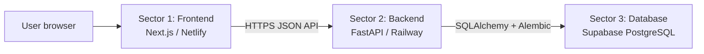

# Next-path System Architecture and Delivery Review

**Review date:** 2026-10-06  
**Release reviewed:** `35d5095`  
**Production frontend:** <https://nextpathla-public-v2.netlify.app/>  
**Production backend:** <https://next-path-production.up.railway.app/>

## 1. System boundary

Next-path is split into three operational sectors. Each sector has a clear
owner, a small contract, and a separate debugging entry point.



The browser never connects directly to the database. The Backend is the only
component that writes sessions, answers, reports, and feedback.

## 2. Sector contracts

### Sector 1 — Frontend

**Responsibility**

- Render the Lao-first questionnaire and report pages.
- Create one anonymous session per assessment run.
- Save answers through the Backend API.
- Clear the browser session and draft after a completed report or an explicit
  new start.
- Display the report returned by the Backend and provide JSON/Markdown export.

**Contract**

- API base: `NEXT_PUBLIC_API_BASE_URL`.
- Active form request: `GET /api/v1/form?version=v4.0.0`.
- Required session sequence: create → answer upserts → complete → status/report.
- Frontend must not construct scores or write database records directly.

**Debug entry points**

1. Browser Network panel: check the request URL, status, and CORS response.
2. `api/assessment.ts`, `api/session.ts`, `api/report.ts`: check payload and
   endpoint contracts.
3. `hooks/useSession.ts` and `utils/draft.ts`: check stale session/draft state.
4. Netlify deploy log: confirm the deployed commit and environment variable.

### Sector 2 — Backend

**Responsibility**

- Validate and sanitize incoming answers.
- Enforce questionnaire version and answer rules.
- Persist raw answers and typed demographic fields.
- Complete sessions and allocate readable response codes.
- Run the version-specific deterministic scoring service.
- Persist a report snapshot and relational ranked paths.
- Expose read-only health/form/report/export endpoints and write endpoints for
  the assessment flow.

**Contract**

- Runtime: FastAPI on Railway.
- Public API prefix: `/api/v1`.
- Active web form: `v4.0.0`; legacy compatibility: `v0.9.1`.
- Database migrations run from `backend/entrypoint.sh` before Uvicorn starts.
- Production code must use Alembic migrations; `create_all` is development-only.

**Debug entry points**

1. `/health` and `/api/v1/form` for service and form availability.
2. Railway deployment and application logs for startup/migration failures.
3. `backend/app/routers/` for HTTP contract problems.
4. `backend/app/services/` for persistence/state transitions.
5. `backend/app/ds/` and `backend/v4.0/` for scoring/version problems.
6. `backend/alembic/versions/` for schema drift or migration failures.

### Sector 3 — Database

**Responsibility**

- Store raw first-party responses as durable relational records.
- Store report snapshots needed to reproduce the user-facing result.
- Store typed fields needed for future analysis without rewriting raw answers.
- Preserve foreign-key and uniqueness rules.

**Contract**

- Provider: Supabase PostgreSQL (`nextpath-db`).
- Access: Backend only, through `DATABASE_URL`.
- Schema changes: additive Alembic migration, reviewed before production.
- JSON is allowed for raw multi-select values and report presentation fields;
  queryable identifiers and ranked outcomes remain columns/rows.

**Debug entry points**

1. Confirm Railway `DATABASE_URL` and connection logs.
2. Check the Alembic revision in `alembic_version`.
3. Check foreign keys and unique constraints before inspecting row values.
4. Trace one session by `sessions.id` → `answers` → `reports` →
   `report_paths` → `feedbacks`.

## 3. End-to-end workflow

```text
Frontend: create session
    ↓
Backend: sessions row
    ↓
Frontend: answer upserts (D1–D3, Q1–Q28)
    ↓
Backend: answers rows, one row per session/question
    ↓
Frontend: complete
    ↓
Backend: validate → set typed age/province → allocate response_code
    ↓
Backend: deterministic scoring → reports snapshot + report_paths rows
    ↓
Frontend: fetch report / export / optional feedback
```

## 4. Database codebook

### Identifiers

| Code | Meaning | Rule |
|---|---|---|
| `D1` | Age demographic | Numeric `text_value`; copied to `sessions.age_years` on completion |
| `D2` | Education level / current study status | Preserve original answer in `answers` |
| `D3` | Province demographic | `option_codes[0]` maps to `province_catalog.form_option_code` |
| `Q1`–`Q28` | Assessment questions | Never reuse a code for a different question meaning |
| `C1`–`C7` | Deterministic scoring/path groups | Versioned by the scoring contract |
| `v4.0.0` | Active web questionnaire | Frontend sends this explicitly |
| `v0.9.1` | Legacy compatibility form | Keep its option codes and engine separate |

### Tables and keys

| Table | Primary key | Foreign keys / constraints | Use |
|---|---|---|---|
| `sessions` | `id` (UUID string) | `province_code → province_catalog`; unique `response_code` | Anonymous run and typed demographics |
| `answers` | `id` | `session_id → sessions`; unique `(session_id, question_id)` | Raw answer source of truth |
| `reports` | `id` | unique `session_id → sessions` | Reproducible presentation snapshot |
| `report_paths` | `id` | `report_id → reports`; rank `1..3`; unique `(report_id, rank)` | Queryable ranked outcomes |
| `feedbacks` | `id` | `session_id → sessions` | Post-report feedback |
| `province_catalog` | `province_code` | unique `form_option_code` | Stable province codebook |
| `response_counters` | `(year, province_code)` | counter row for response code allocation | Concurrency-safe sequence |

### Response code

Completed sessions receive a readable code such as `2026-VTE-000001`:

```text
<local year>-<province code>-<sequence>
```

It must never contain a name, email, phone number, occupation, or path label.

### Province codebook

The active form has 18 province/capital options. These stable English codes are
used in `province_catalog.province_code`, response codes, and future analysis:

| Form option | Database code | Form option | Database code |
|---|---|---|---|
| `D3-O01` | `VTE` | `D3-O10` | `XAY` |
| `D3-O02` | `VTP` | `D3-O11` | `BOL` |
| `D3-O03` | `PSL` | `D3-O12` | `KHM` |
| `D3-O04` | `LNT` | `D3-O13` | `SVK` |
| `D3-O05` | `ODX` | `D3-O14` | `SLV` |
| `D3-O06` | `BOK` | `D3-O15` | `SEK` |
| `D3-O07` | `LPB` | `D3-O16` | `CPS` |
| `D3-O08` | `HPH` | `D3-O17` | `ATP` |
| `D3-O09` | `XKH` | `D3-O18` | `XSB` |

## 5. Risk assessment

| ID | Risk / failure point | Severity | Current status | Response |
|---|---|---:|---|---|
| R-01 | Production process could call SQLAlchemy `create_all` and skip migration seed data | High | **Fixed in this review** | Production `init_db()` now does nothing; `entrypoint.sh` owns migrations |
| R-02 | Railway starts with missing/incorrect `DATABASE_URL` | High | Open operational risk | Check Railway variable and migration log before release; `/health` alone is not a database readiness check |
| R-03 | Frontend hostname changes without matching `CORS_ORIGINS` | High | Controlled | Add the exact HTTPS origin in Railway before testing browser writes |
| R-04 | Backend or Supabase outage during answer writes | High | Recoverable | Draft remains in browser; user can retry; inspect API status/CORS and Railway logs |
| R-05 | Anonymous write endpoints can be spammed | Medium | Not required for current handoff | Add rate limiting and abuse controls before public-scale collection |
| R-06 | Anonymous sessions accumulate without retention/cleanup policy | Medium | Open product/data policy | Define retention and deletion policy before long-running collection |
| R-07 | A form/scoring version is changed without a matching migration and fixtures | High | Controlled by docs/tests | Bump version; keep raw answers and old scoring readable |
| R-08 | Report generation is requested twice by concurrent tabs/effects | Medium | Mitigated | Frontend request de-duplication plus unique report row and conflict recovery |
| R-09 | A production write smoke test could insert test data into the live dataset | Medium | Intentionally not run | Use staging or one explicitly approved test session before collecting real data |
| R-10 | Health endpoint can be green while database is unavailable | Medium | Known limitation | Treat health as liveness; inspect DB connectivity separately during incidents |

No known customer-facing blocker remains in the reviewed release. R-02, R-05,
R-06, and R-10 are operational follow-up items, not reasons to hold the current
web handoff when the provider settings are already confirmed.

## 6. Delivery verification record

- Frontend lint: passed with no errors or warnings.
- Frontend production build: passed; all application routes generated.
- Backend full suite: 73 tests passed in the latest completed verification run.
- Migration check: baseline plus analytics migration applied to isolated SQLite;
  expected tables, primary keys, foreign keys, and constraints present.
- Production read-only checks: frontend routes, backend health, form, OpenAPI,
  and CORS behavior confirmed.
- Production write flow: intentionally not executed to avoid inserting a test
  respondent into the live database; local end-to-end flow is covered by the
  backend suite.

## 7. Incident triage order

When a user reports a failure, identify the first failing sector:

1. **Frontend:** page loads but a request fails → inspect Network/CORS and
   Netlify environment variable.
2. **Backend:** request reaches Railway but returns `4xx/5xx` → inspect route,
   validation, service logs, then scoring version.
3. **Database:** backend reports connection/migration/constraint errors → check
   `DATABASE_URL`, Alembic revision, and the session foreign-key chain.
4. **Data correctness:** trace one session by UUID and compare raw `answers`
   with `reports` and `report_paths`; never edit raw answers to repair a report.
